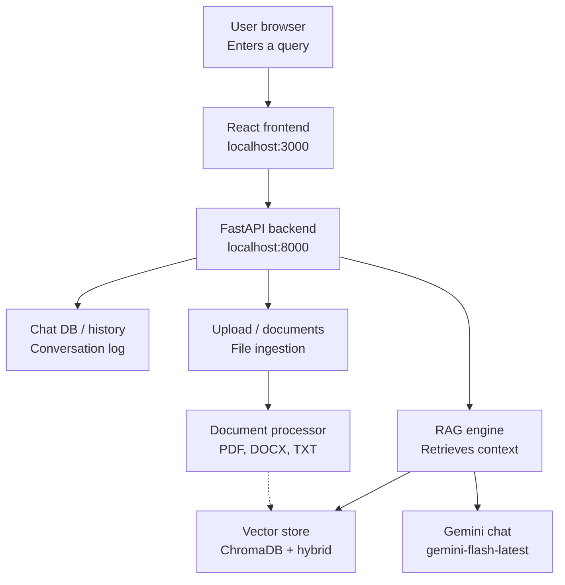

# Document Q&A - RAG System

A Retrieval-Augmented Generation (RAG) app with a **React** frontend and **FastAPI** backend, powered by **Google Gemini** (free models).

---

## Architecture Diagram


### Architecture (Mermaid)



### How data flows

| Step | What happens |
|------|----------------|
| 1 | User opens React UI (`localhost:3000`) and asks a question or uploads a file |
| 2 | Frontend calls FastAPI (`localhost:8000`) |
| 3 | **Upload path:** Document processor extracts text → Gemini embeddings → ChromaDB |
| 4 | **Query path:** Hybrid search on ChromaDB → RAG engine builds context → Gemini answers |
| 5 | Chat messages are stored in Chat DB / history |

---

## Complete Project Structure

```
RAGs/
│
├── backend/                          # Python FastAPI + RAG core
│   ├── __init__.py                   # Package marker
│   ├── main.py                       # API routes (upload, query, chat)
│   ├── rag_engine.py                 # RAG orchestration + Gemini chat
│   ├── vector_store.py               # ChromaDB + Gemini embeddings + hybrid search
│   ├── document_processor.py         # PDF / DOCX / TXT / MD / CSV parsing
│   ├── chat_db.py                    # Persistent chat conversations / messages
│   ├── chat_history.py               # Conversation helpers
│   ├── config.py                     # Env, models, paths, chunk settings
│   └── logger.py                     # Logging helpers
│
├── frontend/                         # React (Vite) UI
│   ├── index.html                    # HTML shell
│   ├── package.json                  # Frontend dependencies
│   ├── package-lock.json
│   ├── vite.config.js                # Vite dev server config
│   └── src/
│       ├── App.jsx                   # Main chat + upload UI
│       ├── main.jsx                  # React entry point
│       └── styles.css                # ChatGPT-style theme
│
├── images/
│   └── rag architecture diagram.png    # Architecture diagram
│
├── data/                             # Runtime data (created at run)
│   ├── vector_store/                # ChromaDB persist (or LOCALAPPDATA on OneDrive)
│   ├── chat_history/                 # Chat session storage
│   ├── uploads/                      # Temp uploads
│   └── processed/                    # Processed line mappings
│
├── logs/                             # Application logs
│   ├── rag_system.log
│   ├── queries.log
│   ├── documents.log
│   └── errors.log
│
├── images/                           # Docs assets
│   └── rag architecture diagram.png
│
├── Dockerfile                        # Production Docker image
├── Dockerfile.dev                    # Dev Docker image
├── docker-compose.yml                # Docker Compose services
├── docker-entrypoint-dev.sh          # Dev container entrypoint
├── DOCKER_DEPLOYMENT.md              # Docker deploy guide
├── .dockerignore
│
├── .env                              # GEMINI_API_KEY (do not commit secrets)
├── env_template.txt                   # Env template
├── requirements.txt                  # Python dependencies
├── run_all.py                        # Start backend + frontend together
└── README.md                         # This file
```

### File roles (quick map)

| File | Role in architecture |
|------|---------------------|
| `frontend/src/App.jsx` | User browser UI — query, upload, chat |
| `backend/main.py` | FastAPI backend — routes to RAG / chat / upload |
| `backend/rag_engine.py` | RAG engine — retrieve context + call Gemini chat |
| `backend/vector_store.py` | Vector store — ChromaDB + hybrid search + embeddings |
| `backend/document_processor.py` | Document processor — PDF, DOCX, TXT, etc. |
| `backend/chat_db.py` | Chat DB / history — conversation log |
| `backend/config.py` | Models (`gemini-flash-latest`, `gemini-embedding-2`) + paths |
| `run_all.py` | One-command launcher for FE + BE |

---

## Quick Start

### 1. Setup Environment

```bash
cd RAGs
copy env_template.txt .env
```

Edit `.env`:

```env
GEMINI_API_KEY=your-gemini-api-key-here
CHAT_MODEL=gemini-flash-latest
```

Get a free key: https://aistudio.google.com/apikey

### 2. Install Dependencies

```bash
# Optional: use a venv
python -m venv rags
rags\Scripts\activate

pip install -r requirements.txt

cd frontend
npm install
cd ..
```

### 3. Run the Application

```bash
python run_all.py
```

This starts:

- Frontend: http://localhost:3000  
- Backend: http://localhost:8000  
- API Docs: http://localhost:8000/docs  

---

## Features

- ChatGPT-style UI
- PDF, Word, Text, Markdown, CSV support
- Line-level citations
- Hybrid search (semantic + keyword)
- Gemini free models for chat + embeddings
- Chat history / conversations
- Docker support

---

## API Endpoints

| Method | Endpoint | Description |
|--------|----------|-------------|
| GET | `/health` | Health check |
| GET | `/documents` | List indexed documents |
| POST | `/upload` | Upload a document |
| DELETE | `/documents/{id}` | Delete a document |
| POST | `/query` | Ask a question (RAG) |
| GET | `/chat/conversations` | List conversations |
| GET | `/chat/messages` | Get messages |
| POST | `/chat/messages` | Save a message |
| DELETE | `/chat/messages` | Clear conversation messages |
| PUT | `/chat/conversations/{id}` | Rename conversation |
| DELETE | `/clear-all` | Clear all documents + chat data |

---

## Models (Gemini)

| Purpose | Default model |
|---------|----------------|
| Chat | `gemini-flash-latest` |
| Embeddings | `gemini-embedding-2` |

Override in `.env` if needed.

---

## Configuration

Edit `backend/config.py` or `.env` for:

- `GEMINI_API_KEY`
- `CHAT_MODEL` / `EMBEDDING_MODEL`
- Chunk size / overlap
- Vector store path

---

## License

MIT
